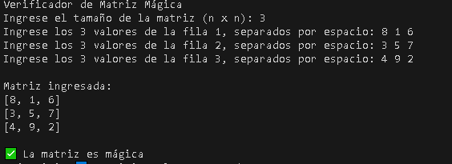
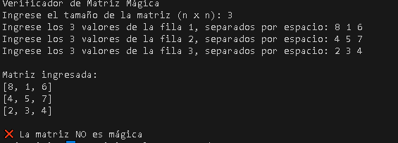
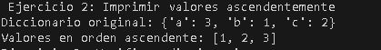
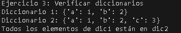
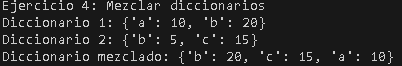
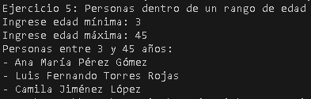

# Ejercicios Matrices y Diccionarios
## Bryan Felipe Jaime Diaz

### A continuacion se mostrara las soluciones a los problemas propuestos
#### Ejercicio de matriz mágica

#### Ejercicio de diccionarios #1

#### Ejercicio diccionarios #2

#### Ejercicio diccionarios #3

#### Ejercicio diccionarios #4

