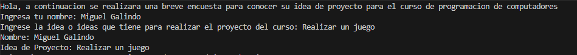
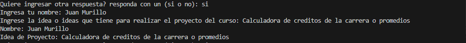
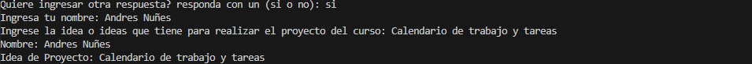
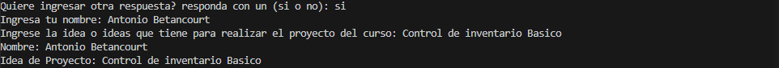
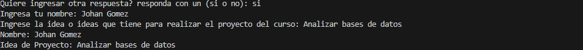
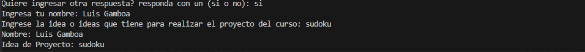

## A continuacion se realiza una encuesta para conocer las ideas de proyectos que tienen los compañeros de curso
### La encuesta se realiza con este programa en el que se pide al usuario que ingrese su nombre y su idea de proyecto dentro de un bucle while con la condicion de que sea verdadero, y para romper con el bucle se le pregunta al usuario si desea seguir recibiendo respuestas, en caso de que diga "si", el bucle se repite, si dice otra cosa el bucle se rompe.

## Resultados de la encuesta
## Encuestado # 1 
## Encuestado # 2 
## Encuestado # 3 
## Encuestado # 4 
## Encuestado # 5 
## Encuestado # 6 